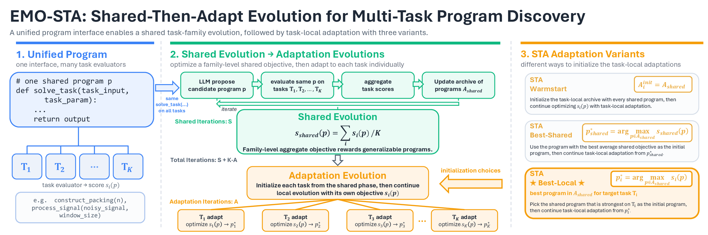

<h1 align="center">
Evolutionary Multi-Task Optimization for LLM-Guided Program Discovery
</h1>

<p align="center">
  <a href="LICENSE">
    
  </a>
  <a href="https://arxiv.org/abs/2605.22613">
    
  </a>
  
</p>

> EMO-STA studies how LLM-guided evolutionary search can transfer useful
> program structure across related tasks. A shared population is evolved once,
> then adapted into task-local searches under a compute budget matched to
> independent single-task baselines.

<p align="center">
  
</p>

This repository implements EMO-STA, an evolutionary multi-task workflow for program discovery. A shared evolutionary run first searches for programs that work well across a related family of tasks. Task-specific adaptation runs are then initialized from the shared archive, allowing useful structure found during the shared phase to be reused and refined.

The paper evaluates three STA (shared-then-adapt) variants:

- **STA Warmstart:** initialize each task-local adaptation run from the projected shared archive.
- **STA Best-Shared:** adapt the program with the best average shared-family score.
- **STA Best-Local:** adapt the shared-archive program that already performs best on the target task.

The main empirical evaluation covers eight task families spanning continuous optimization, geometric construction, modeling, and algorithmic optimization: function minimization, circle packing, circle-packing rectangles, Heilbronn triangle, signal processing, SLDBench-3D, Rust adaptive sort, and K-module. The paper also includes low-evidence generalization case studies on ARC-AGI and COVID Deaths time-series feature engineering.

The implementation builds on OpenEvolve. The original OpenEvolve README is available at [README_openevolve.md](README_openevolve.md).

## Repository Layout

- [openevolve/](openevolve/) contains the underlying evolutionary program-search framework.
- [multi_task_shared_then_adapt/configs/](multi_task_shared_then_adapt/configs/) contains EMO-STA benchmark-family configuration files.
- [multi_task_shared_then_adapt/scripts/](multi_task_shared_then_adapt/scripts/) contains launchers, repeated-trial runners, reporting utilities, and post-hoc evaluation scripts.
- [multi_task_shared_then_adapt/plotting/](multi_task_shared_then_adapt/plotting/) contains scripts for generating paper tables, budget plots, trajectory plots, and OOD figures.
- [multi_task_shared_then_adapt/docs/](multi_task_shared_then_adapt/docs/) contains result summaries, appendix-ready tables, plot captions, and detailed workflow notes.
- [multi_task_shared_then_adapt/figures/](multi_task_shared_then_adapt/figures/) contains generated paper-facing figures and figure metadata.
- [multi_task_shared_then_adapt/logs/](multi_task_shared_then_adapt/logs/) and `multi_task_shared_then_adapt/results/` are used for local launch logs and experiment outputs.

## Installation

Create a Python environment with Python 3.10 or newer, then install the repository in editable mode:

```bash
pip install -e ".[dev]"
```

Some benchmark families require task-specific Python packages. See the relevant example directory or the detailed EMO-STA notes when running a specific family.

## Configuration

EMO-STA uses the same model configuration style as OpenEvolve. You can configure an OpenAI-compatible API endpoint through configs or command-line flags with `OPENAI_API_BASE` and `OPENAI_API_KEY`, or run through LiteLLM using [configs/litellm_proxy.yaml](configs/litellm_proxy.yaml). The included LiteLLM config uses provider-specific environment credentials, such as `AWS_BEARER_TOKEN_BEDROCK` for the Claude model aliases used in the main experiments.

## Benchmarks and Budgets

Main-paper budgets are reported as `Shared / Per-task Adapt / Total` iterations. `Total` is the matched family-level compute, computed as `Shared + task_count * Adapt`. The main tables report five Claude-family models: Haiku-4.5, Sonnet-4.5, Sonnet-4.6, Opus-4.5, and Opus-4.6.

| Family | Benchmark config | Tasks | Main budget |
| --- | --- | --- | --- |
| Function minimization | `multi_task_shared_then_adapt/configs/function_minimization_emo_sta.yaml` | `fm_sincosxy_2d`, `fm_ackley_2d`, `fm_rastrigin_2d`, `fm_rosenbrock_2d` | `40 / 15 / 100` |
| Circle packing | `multi_task_shared_then_adapt/configs/circle_packing_emo_sta.yaml` | `cp_n20`, `cp_n22`, `cp_n24`, `cp_n26` | `60 / 15 / 120` |
| Circle-packing rectangles | `multi_task_shared_then_adapt/configs/circle_packing_rectangle_emo_sta.yaml` | `cp_rect_n20`, `cp_rect_n21`, `cp_rect_n22`, `cp_rect_n23` | `60 / 15 / 120` |
| Heilbronn triangle | `multi_task_shared_then_adapt/configs/heilbronn_triangle_emo_sta.yaml` | `heil_tri_n9`, `heil_tri_n10`, `heil_tri_n11`, `heil_tri_n12` | `60 / 15 / 120` |
| Signal processing | `multi_task_shared_then_adapt/configs/signal_processing_emo_sta.yaml` | `sp_trend_sine_500_n02`, `sp_multifreq_600_n03`, `sp_chirp_700_n04`, `sp_step_800_n05` | `60 / 10 / 100` |
| SLDBench-3D | `multi_task_shared_then_adapt/configs/sldbench_3d_emo_sta.yaml` | `vocab_scaling_law`, `data_constrained_scaling_law` | `60 / 10 / 80` |
| Rust adaptive sort | `multi_task_shared_then_adapt/configs/rust_adaptive_sort_emo_sta.yaml` | `ras_random`, `ras_nearly_sorted`, `ras_reverse_sorted`, `ras_duplicates` | `60 / 10 / 100` |
| K-module | `multi_task_shared_then_adapt/configs/k_module_problem_emo_sta.yaml` | `kmb_task_a`, `kmb_task_b`, `kmb_task_c`, `kmb_task_d` | `40 / 20 / 120` |

## Running EMO-STA

Choose a benchmark configuration from [multi_task_shared_then_adapt/configs/](multi_task_shared_then_adapt/configs/). For example, the command below launches repeated trials for circle packing with matched family-level compute: `60 + 4 x 15 = 30 x 4 = 120` total iterations per trial. It enables all three STA adaptation variants evaluated in the paper:

```bash
python multi_task_shared_then_adapt/scripts/run_multi_task_shared_then_adapt_trials.py \
  --benchmark-config multi_task_shared_then_adapt/configs/circle_packing_emo_sta.yaml \
  --trials 5 \
  --shared-iterations 60 \
  --adaptation-iterations 15 \
  --baseline-iterations 30 \
  --run-warmstart-adaptation \
  --run-best-shared-adaptation \
  --run-best-local-adaptation
```

The launcher writes stable run directories, per-trial logs, trial summaries, and refreshed EMO-STA result summaries under the selected family result directory.

For a single end-to-end run without repeated trials:

```bash
python multi_task_shared_then_adapt/scripts/run_multi_task_shared_then_adapt.py \
  --benchmark-config multi_task_shared_then_adapt/configs/circle_packing_emo_sta.yaml \
  --shared-iterations 60 \
  --adaptation-iterations 15 \
  --baseline-iterations 30 \
  --run-warmstart-adaptation \
  --run-best-shared-adaptation \
  --run-best-local-adaptation
```

The archive warmstart branch is enabled by default for backward compatibility. Omitting the best-shared and best-local flags runs only that default branch; `--skip-warmstart-adaptation` disables only the archive warmstart branch.

## Results and Figures

Aggregated result summaries are available under:

- [multi_task_shared_then_adapt/docs/emo_sta_results_summary.md](multi_task_shared_then_adapt/docs/emo_sta_results_summary.md)
- [multi_task_shared_then_adapt/docs/emo_sta_table.md](multi_task_shared_then_adapt/docs/emo_sta_table.md)
- [multi_task_shared_then_adapt/figures/](multi_task_shared_then_adapt/figures/)

Output run directories are written under `multi_task_shared_then_adapt/results/` when running experiments.

## Detailed Documentation

For implementation details, workflow behavior, adaptation branches, plotting utilities, and per-family notes, see [multi_task_shared_then_adapt/docs/README.md](multi_task_shared_then_adapt/docs/README.md).

## Citation

If you use this repository, please cite **"Evolutionary Multi-Task Optimization for LLM-Guided Program Discovery"**.
