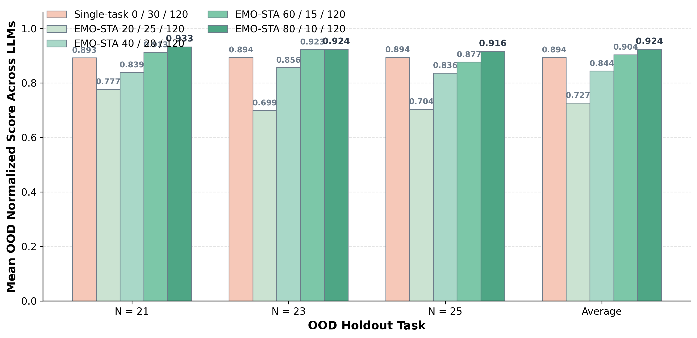
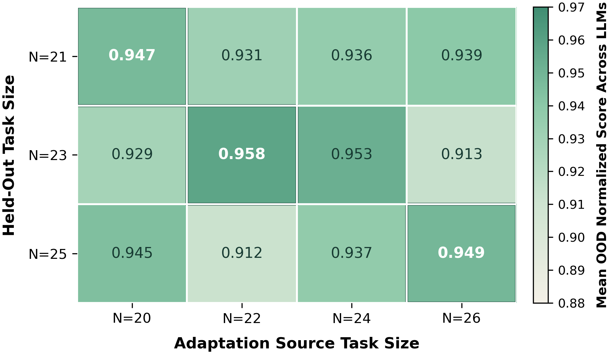
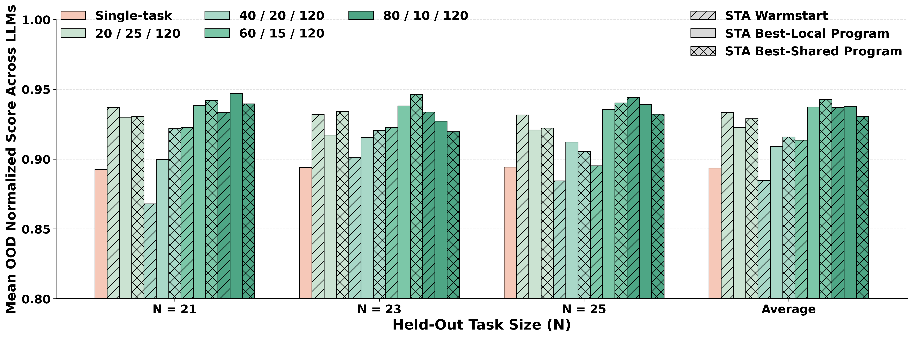
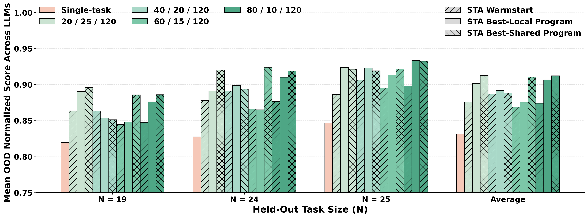
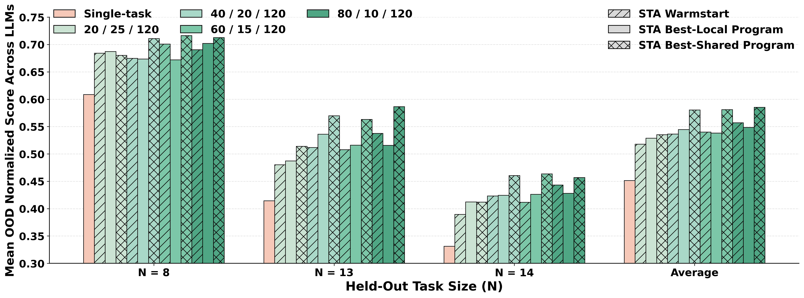
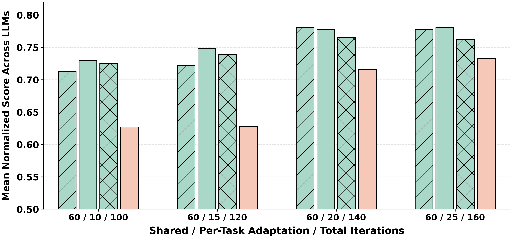

## Adaptation Methods Comparison Table

### Continuous Optimization

#### Markdown

| Model | <div align="center">Function<br>minimization</div> | <div align="center">Circle<br>packing</div> | <div align="center">Circle packing<br>rectangles</div> | <div align="center">Heilbronn<br>triangle</div> |
| --- | --- | --- | --- | --- |
| **Format** | STA Best-Local ± std / STA Warmstart ± std / STA Best-Shared ± std / Single-task ± std | STA Best-Local ± std / STA Warmstart ± std / STA Best-Shared ± std / Single-task ± std | STA Best-Local ± std / STA Warmstart ± std / STA Best-Shared ± std / Single-task ± std | STA Best-Local ± std / STA Warmstart ± std / STA Best-Shared ± std / Single-task ± std |
| **Haiku-4.5** | **.952 ± .04** / .949 ± .05 / .941 ± .06 / .888 ± .05 | .934 ± .03 / .926 ± .03 / **.940 ± .02** / .865 ± .03 | .861 ± .02 / **.865 ± .02** / .845 ± .01 / .832 ± .01 | **.650 ± .06** / .628 ± .05 / .628 ± .06 / .547 ± .03 |
| **Sonnet-4.5** | **.925 ± .02** / .917 ± .02 / .904 ± .03 / .891 ± .05 | **.965 ± .02** / .964 ± .02 / .947 ± .03 / .927 ± .02 | **.898 ± .03** / .890 ± .03 / .892 ± .04 / .840 ± .02 | **.622 ± .04** / .596 ± .05 / .619 ± .05 / .548 ± .04 |
| **Opus-4.5** | **.969 ± .03** / .942 ± .07 / .941 ± .09 / .914 ± .05 | **.940 ± .01** / .926 ± .01 / .930 ± .01 / .912 ± .01 | **.951 ± .01** / .943 ± .01 / .943 ± .01 / .912 ± .01 | **.741 ± .03** / .732 ± .04 / .704 ± .04 / .622 ± .06 |
| **Sonnet-4.6** | .988 ± .02 / .973 ± .03 / **.991 ± .02** / .901 ± .02 | **.997 ± .00** / .997 ± .00 / .997 ± .00 / .957 ± .03 | **.986 ± .01** / .985 ± .01 / .985 ± .01 / .967 ± .02 | .862 ± .04 / .809 ± .04 / **.865 ± .07** / .678 ± .05 |
| **Opus-4.6** | **.945 ± .03** / .943 ± .03 / .932 ± .04 / .895 ± .04 | **.984 ± .01** / .972 ± .02 / .979 ± .02 / .963 ± .01 | **.967 ± .01** / .957 ± .01 / .962 ± .01 / .944 ± .01 | .863 ± .03 / .844 ± .03 / **.877 ± .03** / .744 ± .04 |


#### LaTeX

```latex
\begin{table*}[t]
\centering
\caption{\small{Comparison of standard single-task and EMO-STA optimization for continuous optimization families. Each score cell reports \textit{mean $\pm$ std}; the first line is \textit{STA Best-Local / STA Warmstart}, and the second line is \textit{STA Best-Shared / Single-task}. Bold marks the largest mean among the four scores in each cell.}}
\label{tab:emo-sta-main-adaptation-constructive}
\footnotesize
\setlength{\tabcolsep}{4pt}
\renewcommand{\arraystretch}{1.07}
\setlength{\aboverulesep}{0.5ex}
\setlength{\belowrulesep}{0.5ex}

\providecommand{\emostacell}[1]{\begin{tabular}[c]{@{}c@{}}#1\end{tabular}}

\providecommand{\emostascorecell}[4]{%
\begin{tabular}[c]{@{}c@{}}
$#1$ / $#2$\\[-1pt]
$#3$ / $#4$
\end{tabular}}

\resizebox{\textwidth}{!}{%
\begin{tabular}{lcccc}
\toprule
\multirow{4}{*}{Model}
& \emostacell{Function}
& \emostacell{Circle}
& \emostacell{Circle packing}
& \emostacell{Heilbronn} \\
& \emostacell{minimization}
& \emostacell{packing}
& \emostacell{rectangles}
& \emostacell{triangle} \\[-1pt]
& {\scriptsize STA Best-Local / STA Warmstart}
& {\scriptsize STA Best-Local / STA Warmstart}
& {\scriptsize STA Best-Local / STA Warmstart}
& {\scriptsize STA Best-Local / STA Warmstart} \\[-2pt]
& {\scriptsize STA Best-Shared / Single-task}
& {\scriptsize STA Best-Shared / Single-task}
& {\scriptsize STA Best-Shared / Single-task}
& {\scriptsize STA Best-Shared / Single-task} \\
\midrule

\textbf{Haiku-4.5}
& \emostascorecell{\mathbf{.952 \pm .04}}{.949 \pm .05}{.941 \pm .06}{.888 \pm .05}
& \emostascorecell{.934 \pm .03}{.926 \pm .03}{\mathbf{.940 \pm .02}}{.865 \pm .03}
& \emostascorecell{.861 \pm .02}{\mathbf{.865 \pm .02}}{.845 \pm .01}{.832 \pm .01}
& \emostascorecell{\mathbf{.650 \pm .06}}{.628 \pm .05}{.628 \pm .06}{.547 \pm .03} \\
\midrule

\textbf{Sonnet-4.5}
& \emostascorecell{\mathbf{.925 \pm .02}}{.917 \pm .02}{.904 \pm .03}{.891 \pm .05}
& \emostascorecell{\mathbf{.965 \pm .02}}{.964 \pm .02}{.947 \pm .03}{.927 \pm .02}
& \emostascorecell{\mathbf{.898 \pm .03}}{.890 \pm .03}{.892 \pm .04}{.840 \pm .02}
& \emostascorecell{\mathbf{.622 \pm .04}}{.596 \pm .05}{.619 \pm .05}{.548 \pm .04} \\
\midrule

\textbf{Opus-4.5}
& \emostascorecell{\mathbf{.969 \pm .03}}{.942 \pm .07}{.941 \pm .09}{.914 \pm .05}
& \emostascorecell{\mathbf{.940 \pm .01}}{.926 \pm .01}{.930 \pm .01}{.912 \pm .01}
& \emostascorecell{\mathbf{.951 \pm .01}}{.943 \pm .01}{.943 \pm .01}{.912 \pm .01}
& \emostascorecell{\mathbf{.741 \pm .03}}{.732 \pm .04}{.704 \pm .04}{.622 \pm .06} \\
\midrule

\textbf{Sonnet-4.6}
& \emostascorecell{.988 \pm .02}{.973 \pm .03}{\mathbf{.991 \pm .02}}{.901 \pm .02}
& \emostascorecell{\mathbf{.997 \pm .00}}{\mathbf{.997 \pm .00}}{\mathbf{.997 \pm .00}}{.957 \pm .03}
& \emostascorecell{\mathbf{.986 \pm .01}}{.985 \pm .01}{.985 \pm .01}{.967 \pm .02}
& \emostascorecell{.862 \pm .04}{.809 \pm .04}{\mathbf{.865 \pm .07}}{.678 \pm .05} \\
\midrule

\textbf{Opus-4.6}
& \emostascorecell{\mathbf{.945 \pm .03}}{.943 \pm .03}{.932 \pm .04}{.895 \pm .04}
& \emostascorecell{\mathbf{.984 \pm .01}}{.972 \pm .02}{.979 \pm .02}{.963 \pm .01}
& \emostascorecell{\mathbf{.967 \pm .01}}{.957 \pm .01}{.962 \pm .01}{.944 \pm .01}
& \emostascorecell{.863 \pm .03}{.844 \pm .03}{\mathbf{.877 \pm .03}}{.744 \pm .04} \\

\bottomrule
\end{tabular}%
}
\end{table*}
```

### Modeling & Algorithmic Optimization

#### Markdown

| Model | <div align="center">Signal<br>processing</div> | <div align="center">SLDBench-3D</div> | <div align="center">Rust adaptive<br>sort</div> | <div align="center">K-module</div> |
| --- | --- | --- | --- | --- |
| **Format** | STA Best-Local ± std / STA Warmstart ± std / STA Best-Shared ± std / Single-task ± std | STA Best-Local ± std / STA Warmstart ± std / STA Best-Shared ± std / Single-task ± std | STA Best-Local ± std / STA Warmstart ± std / STA Best-Shared ± std / Single-task ± std | STA Best-Local ± std / STA Warmstart ± std / STA Best-Shared ± std / Single-task ± std |
| **Haiku-4.5** | **.600 ± .05** / .584 ± .06 / .597 ± .04 / .569 ± .01 | **.958 ± .02** / .953 ± .02 / .949 ± .02 / .951 ± .01 | .533 ± .02 / .535 ± .02 / .509 ± .03 / **.539 ± .02** | .567 ± .06 / .567 ± .04 / **.575 ± .07** / .550 ± .03 |
| **Sonnet-4.5** | **.587 ± .01** / .578 ± .02 / .582 ± .02 / .576 ± .01 | **.976 ± .01** / .971 ± .01 / .971 ± .02 / .959 ± .01 | .481 ± .03 / .484 ± .03 / .457 ± .03 / **.528 ± .01** | .617 ± .03 / **.650 ± .02** / .567 ± .06 / .617 ± .05 |
| **Opus-4.5** | .620 ± .03 / **.635 ± .03** / .625 ± .02 / .568 ± .01 | **.983 ± .00** / .972 ± .01 / .981 ± .00 / .973 ± .01 | .515 ± .05 / **.520 ± .05** / .483 ± .05 / .497 ± .02 | .617 ± .03 / **.675 ± .03** / .592 ± .03 / .567 ± .05 |
| **Sonnet-4.6** | **.628 ± .04** / .626 ± .04 / .613 ± .05 / .608 ± .03 | .969 ± .01 / .968 ± .01 / **.969 ± .01** / .955 ± .01 | .659 ± .01 / **.663 ± .01** / .656 ± .01 / .616 ± .03 | .617 ± .09 / **.700 ± .07** / .575 ± .03 / .675 ± .05 |
| **Opus-4.6** | .713 ± .05 / .707 ± .04 / **.716 ± .04** / .648 ± .03 | **.975 ± .01** / .973 ± .01 / .967 ± .01 / .964 ± .02 | .616 ± .02 / **.625 ± .02** / .612 ± .02 / .531 ± .05 | .725 ± .02 / **.800 ± .05** / .692 ± .05 / .758 ± .08 |


#### LaTeX

```latex
\begin{table*}[t]
\centering
\caption{\small{Comparison of standard single-task and EMO-STA optimization for modeling and algorithmic optimization families. Each score cell reports \textit{mean $\pm$ std}; the first line is \textit{STA Best-Local / STA Warmstart}, and the second line is \textit{STA Best-Shared / Single-task}. Bold marks the largest mean among the four scores in each cell.}}
\label{tab:emo-sta-main-adaptation-modeling}
\footnotesize
\setlength{\tabcolsep}{4pt}
\renewcommand{\arraystretch}{1.07}
\setlength{\aboverulesep}{0.5ex}
\setlength{\belowrulesep}{0.5ex}

\providecommand{\emostacell}[1]{\begin{tabular}[c]{@{}c@{}}#1\end{tabular}}

\providecommand{\emostascorecell}[4]{%
\begin{tabular}[c]{@{}c@{}}
$#1$ / $#2$\\[-1pt]
$#3$ / $#4$
\end{tabular}}

\resizebox{\textwidth}{!}{%
\begin{tabular}{lcccc}
\toprule
\multirow{4}{*}{Model}
& \emostacell{Signal}
& \multirow{2}{*}{SLDBench-3D}
& \emostacell{Rust adaptive}
& \multirow{2}{*}{K-module} \\
& \emostacell{processing}
&
& \emostacell{sort}
& \\[-1pt]
& {\scriptsize STA Best-Local / STA Warmstart}
& {\scriptsize STA Best-Local / STA Warmstart}
& {\scriptsize STA Best-Local / STA Warmstart}
& {\scriptsize STA Best-Local / STA Warmstart} \\[-2pt]
& {\scriptsize STA Best-Shared / Single-task}
& {\scriptsize STA Best-Shared / Single-task}
& {\scriptsize STA Best-Shared / Single-task}
& {\scriptsize STA Best-Shared / Single-task} \\
\midrule

\textbf{Haiku-4.5}
& \emostascorecell{\mathbf{.600 \pm .05}}{.584 \pm .06}{.597 \pm .04}{.569 \pm .01}
& \emostascorecell{\mathbf{.958 \pm .02}}{.953 \pm .02}{.949 \pm .02}{.951 \pm .01}
& \emostascorecell{.533 \pm .02}{.535 \pm .02}{.509 \pm .03}{\mathbf{.539 \pm .02}}
& \emostascorecell{.567 \pm .06}{.567 \pm .04}{\mathbf{.575 \pm .07}}{.550 \pm .03} \\
\midrule

\textbf{Sonnet-4.5}
& \emostascorecell{\mathbf{.587 \pm .01}}{.578 \pm .02}{.582 \pm .02}{.576 \pm .01}
& \emostascorecell{\mathbf{.976 \pm .01}}{.971 \pm .01}{.971 \pm .02}{.959 \pm .01}
& \emostascorecell{.481 \pm .03}{.484 \pm .03}{.457 \pm .03}{\mathbf{.528 \pm .01}}
& \emostascorecell{.617 \pm .03}{\mathbf{.650 \pm .02}}{.567 \pm .06}{.617 \pm .05} \\
\midrule

\textbf{Opus-4.5}
& \emostascorecell{.620 \pm .03}{\mathbf{.635 \pm .03}}{.625 \pm .02}{.568 \pm .01}
& \emostascorecell{\mathbf{.983 \pm .00}}{.972 \pm .01}{.981 \pm .00}{.973 \pm .01}
& \emostascorecell{.515 \pm .05}{\mathbf{.520 \pm .05}}{.483 \pm .05}{.497 \pm .02}
& \emostascorecell{.617 \pm .03}{\mathbf{.675 \pm .03}}{.592 \pm .03}{.567 \pm .05} \\
\midrule

\textbf{Sonnet-4.6}
& \emostascorecell{\mathbf{.628 \pm .04}}{.626 \pm .04}{.613 \pm .05}{.608 \pm .03}
& \emostascorecell{.969 \pm .01}{.968 \pm .01}{\mathbf{.969 \pm .01}}{.955 \pm .01}
& \emostascorecell{.659 \pm .01}{\mathbf{.663 \pm .01}}{.656 \pm .01}{.616 \pm .03}
& \emostascorecell{.617 \pm .09}{\mathbf{.700 \pm .07}}{.575 \pm .03}{.675 \pm .05} \\
\midrule

\textbf{Opus-4.6}
& \emostascorecell{.713 \pm .05}{.707 \pm .04}{\mathbf{.716 \pm .04}}{.648 \pm .03}
& \emostascorecell{\mathbf{.975 \pm .01}}{.973 \pm .01}{.967 \pm .01}{.964 \pm .02}
& \emostascorecell{.616 \pm .02}{\mathbf{.625 \pm .02}}{.612 \pm .02}{.531 \pm .05}
& \emostascorecell{.725 \pm .02}{\mathbf{.800 \pm .05}}{.692 \pm .05}{.758 \pm .08} \\

\bottomrule
\end{tabular}%
}
\end{table*}
```

## Appendix Adaptation Methods Comparison Tables

These appendix versions expand the compact main adaptation-methods tables by showing one row per method and by including the pre-adaptation shared score.

### Continuous Optimization


#### LaTeX

```latex
\begin{table*}[!h]
\centering
\caption{\small{Comparison of standard single-task and EMO-STA optimization for continuous optimization families. The budget row reports \textit{Shared / Adapt / Total} iterations, where Total is computed as Shared plus the per-task adaptation budget times the number of tasks in the family.}}
\label{tab:emo-sta-appendix-adaptation-continuous}
\scriptsize
\setlength{\tabcolsep}{4pt}
\renewcommand{\arraystretch}{1.08}
\setlength{\aboverulesep}{0.5ex}
\setlength{\belowrulesep}{0.5ex}

\resizebox{\textwidth}{!}{%
\begin{tabular}{llcccc}
\toprule
Model & Method
& Function minimization
& Circle packing
& Circle packing rectangles
& Heilbronn triangle \\
\midrule
\multicolumn{2}{l}{Budget (Shared / Adapt / Total)}
& $40 / 15 / 100$
& $60 / 15 / 120$
& $60 / 15 / 120$
& $60 / 15 / 120$ \\
\midrule

\multirow{5}{*}{\textbf{Haiku-4.5}}
& STA Best-Shared (Before Adaptation) & $.887 \pm .06$ & $.902 \pm .05$ & $.832 \pm .01$ & $.523 \pm .03$ \\
& STA Best-Local & $\mathbf{.952 \pm .04}$ & $.934 \pm .03$ & $.861 \pm .02$ & $\mathbf{.650 \pm .06}$ \\
& STA Warmstart & $.949 \pm .05$ & $.926 \pm .03$ & $\mathbf{.865 \pm .02}$ & $.628 \pm .05$ \\
& STA Best-Shared & $.941 \pm .06$ & $\mathbf{.940 \pm .02}$ & $.845 \pm .01$ & $.628 \pm .06$ \\
& Single-task & $.888 \pm .05$ & $.865 \pm .03$ & $.832 \pm .01$ & $.547 \pm .03$ \\
\midrule

\multirow{5}{*}{\textbf{Sonnet-4.5}}
& STA Best-Shared (Before Adaptation) & $.862 \pm .03$ & $.938 \pm .03$ & $.875 \pm .04$ & $.472 \pm .08$ \\
& STA Best-Local & $\mathbf{.925 \pm .02}$ & $\mathbf{.965 \pm .02}$ & $\mathbf{.898 \pm .03}$ & $\mathbf{.622 \pm .04}$ \\
& STA Warmstart & $.917 \pm .02$ & $.964 \pm .02$ & $.890 \pm .03$ & $.596 \pm .05$ \\
& STA Best-Shared & $.904 \pm .03$ & $.947 \pm .03$ & $.892 \pm .04$ & $.619 \pm .05$ \\
& Single-task & $.891 \pm .05$ & $.927 \pm .02$ & $.840 \pm .02$ & $.548 \pm .04$ \\
\midrule

\multirow{5}{*}{\textbf{Opus-4.5}}
& STA Best-Shared (Before Adaptation) & $.877 \pm .07$ & $.901 \pm .01$ & $.935 \pm .01$ & $.608 \pm .05$ \\
& STA Best-Local & $\mathbf{.969 \pm .03}$ & $\mathbf{.940 \pm .01}$ & $\mathbf{.951 \pm .01}$ & $\mathbf{.741 \pm .03}$ \\
& STA Warmstart & $.942 \pm .07$ & $.926 \pm .01$ & $.943 \pm .01$ & $.732 \pm .04$ \\
& STA Best-Shared & $.941 \pm .09$ & $.930 \pm .01$ & $.943 \pm .01$ & $.704 \pm .04$ \\
& Single-task & $.914 \pm .05$ & $.912 \pm .01$ & $.912 \pm .01$ & $.622 \pm .06$ \\
\midrule

\multirow{5}{*}{\textbf{Sonnet-4.6}}
& STA Best-Shared (Before Adaptation) & $.946 \pm .03$ & $.995 \pm .00$ & $.993 \pm .00$ & $.711 \pm .05$ \\
& STA Best-Local & $.988 \pm .02$ & $\mathbf{.997 \pm .00}$ & $\mathbf{.986 \pm .01}$ & $.862 \pm .04$ \\
& STA Warmstart & $.973 \pm .03$ & $\mathbf{.997 \pm .00}$ & $.985 \pm .01$ & $.809 \pm .04$ \\
& STA Best-Shared & $\mathbf{.991 \pm .02}$ & $\mathbf{.997 \pm .00}$ & $.985 \pm .01$ & $\mathbf{.865 \pm .07}$ \\
& Single-task & $.901 \pm .02$ & $.957 \pm .03$ & $.967 \pm .02$ & $.678 \pm .05$ \\
\midrule

\multirow{5}{*}{\textbf{Opus-4.6}}
& STA Best-Shared (Before Adaptation) & $.942 \pm .04$ & $.960 \pm .02$ & $.941 \pm .01$ & $.784 \pm .03$ \\
& STA Best-Local & $\mathbf{.945 \pm .03}$ & $\mathbf{.984 \pm .01}$ & $\mathbf{.967 \pm .01}$ & $.863 \pm .03$ \\
& STA Warmstart & $.943 \pm .03$ & $.972 \pm .02$ & $.957 \pm .01$ & $.844 \pm .03$ \\
& STA Best-Shared & $.932 \pm .04$ & $.979 \pm .02$ & $.962 \pm .01$ & $\mathbf{.877 \pm .03}$ \\
& Single-task & $.895 \pm .04$ & $.963 \pm .01$ & $.944 \pm .01$ & $.744 \pm .04$ \\

\bottomrule
\end{tabular}%
}
%\vspace{-5pt}
\end{table*}
```

### Modeling & Algorithmic Optimization


#### LaTeX

```latex
\begin{table*}[!h]
\centering
\caption{\small{Comparison of standard single-task and EMO-STA optimization for modeling and algorithmic optimization families. The budget row reports \textit{Shared / Adapt / Total} iterations, where Total is computed as Shared plus the per-task adaptation budget times the number of tasks in the family.}}
\label{tab:emo-sta-appendix-adaptation-modeling}
\scriptsize
\setlength{\tabcolsep}{4pt}
\renewcommand{\arraystretch}{1.08}
\setlength{\aboverulesep}{0.5ex}
\setlength{\belowrulesep}{0.5ex}

\resizebox{\textwidth}{!}{%
\begin{tabular}{llcccc}
\toprule
Model & Method
& Signal processing
& SLDBench-3D
& Rust adaptive sort
& K-module \\
\midrule
\multicolumn{2}{l}{Budget (Shared / Adapt / Total)}
& $60 / 10 / 100$
& $60 / 10 / 80$
& $60 / 10 / 100$
& $40 / 20 / 120$ \\
\midrule

\multirow{5}{*}{\textbf{Haiku-4.5}}
& STA Best-Shared (Before Adaptation) & $.568 \pm .04$ & $.936 \pm .02$ & $.509 \pm .03$ & $.392 \pm .05$ \\
& STA Best-Local & $\mathbf{.600 \pm .05}$ & $\mathbf{.958 \pm .02}$ & $.533 \pm .02$ & $.567 \pm .06$ \\
& STA Warmstart & $.584 \pm .06$ & $.953 \pm .02$ & $.535 \pm .02$ & $.567 \pm .04$ \\
& STA Best-Shared & $.597 \pm .04$ & $.949 \pm .02$ & $.509 \pm .03$ & $\mathbf{.575 \pm .07}$ \\
& Single-task & $.569 \pm .01$ & $.951 \pm .01$ & $\mathbf{.539 \pm .02}$ & $.550 \pm .03$ \\
\midrule

\multirow{5}{*}{\textbf{Sonnet-4.5}}
& STA Best-Shared (Before Adaptation) & $.559 \pm .02$ & $.955 \pm .02$ & $.458 \pm .03$ & $.367 \pm .02$ \\
& STA Best-Local & $\mathbf{.587 \pm .01}$ & $\mathbf{.976 \pm .01}$ & $.481 \pm .03$ & $.617 \pm .03$ \\
& STA Warmstart & $.578 \pm .02$ & $.971 \pm .01$ & $.484 \pm .03$ & $\mathbf{.650 \pm .02}$ \\
& STA Best-Shared & $.582 \pm .02$ & $.971 \pm .02$ & $.457 \pm .03$ & $.567 \pm .06$ \\
& Single-task & $.576 \pm .01$ & $.959 \pm .01$ & $\mathbf{.528 \pm .01}$ & $.617 \pm .05$ \\
\midrule

\multirow{5}{*}{\textbf{Opus-4.5}}
& STA Best-Shared (Before Adaptation) & $.612 \pm .03$ & $.959 \pm .02$ & $.483 \pm .05$ & $.442 \pm .02$ \\
& STA Best-Local & $.620 \pm .03$ & $\mathbf{.983 \pm .00}$ & $.515 \pm .05$ & $.617 \pm .03$ \\
& STA Warmstart & $\mathbf{.635 \pm .03}$ & $.972 \pm .01$ & $\mathbf{.520 \pm .05}$ & $\mathbf{.675 \pm .03}$ \\
& STA Best-Shared & $.625 \pm .02$ & $.981 \pm .00$ & $.483 \pm .05$ & $.592 \pm .03$ \\
& Single-task & $.568 \pm .01$ & $.973 \pm .01$ & $.497 \pm .02$ & $.567 \pm .05$ \\
\midrule

\multirow{5}{*}{\textbf{Sonnet-4.6}}
& STA Best-Shared (Before Adaptation) & $.607 \pm .05$ & $.959 \pm .01$ & $.656 \pm .01$ & $.383 \pm .05$ \\
& STA Best-Local & $\mathbf{.628 \pm .04}$ & $\mathbf{.969 \pm .01}$ & $.659 \pm .01$ & $.617 \pm .09$ \\
& STA Warmstart & $.626 \pm .04$ & $.968 \pm .01$ & $\mathbf{.663 \pm .01}$ & $\mathbf{.700 \pm .07}$ \\
& STA Best-Shared & $.613 \pm .05$ & $\mathbf{.969 \pm .01}$ & $.656 \pm .01$ & $.575 \pm .03$ \\
& Single-task & $.608 \pm .03$ & $.955 \pm .01$ & $.616 \pm .03$ & $.675 \pm .05$ \\
\midrule

\multirow{5}{*}{\textbf{Opus-4.6}}
& STA Best-Shared (Before Adaptation) & $.653 \pm .04$ & $.958 \pm .02$ & $.612 \pm .02$ & $.450 \pm .03$ \\
& STA Best-Local & $.713 \pm .05$ & $\mathbf{.975 \pm .01}$ & $.616 \pm .02$ & $.725 \pm .02$ \\
& STA Warmstart & $.707 \pm .04$ & $.973 \pm .01$ & $\mathbf{.625 \pm .02}$ & $\mathbf{.800 \pm .05}$ \\
& STA Best-Shared & $\mathbf{.716 \pm .04}$ & $.967 \pm .01$ & $.612 \pm .02$ & $.692 \pm .05$ \\
& Single-task & $.648 \pm .03$ & $.964 \pm .02$ & $.531 \pm .05$ & $.758 \pm .08$ \\

\bottomrule
\end{tabular}%
}
%\vspace{-5pt}
\end{table*}
```

## Circle Packing OOD Figure




### LaTeX

```latex
\begin{figure}[!t]
    \centering
    \includegraphics[width=0.78\linewidth]{figures/circle_packing_ood_b30_by_holdout.pdf}
    \caption{Out-of-distribution holdout evaluation for circle packing at the selected EMO-STA budget $60 / 15 / 120$. The budget is reported as Shared / Adapt / Total, where the total equals $30 \times 4$ single-task iterations. The x-axis shows held-out circle counts ($N=21,23,25$) plus the average across holdouts. EMO-STA Adapt and Single-task average holdout performance over the programs produced for each in-distribution source task. Bars report mean scores across the five models used in the main comparison table.}
    \label{fig:circle-packing-ood-holdouts}
\end{figure}
```

## How Each Family Was Adapted

For every task family, we converted an existing OpenEvolve example or closely related benchmark into a small collection of related subtasks that share one evolving artifact, one evaluator family, and the same shared-then-adapt workflow. In the shared phase, the evolving program is optimized against the average score across the family. We then initialize task-specific continuations from the shared archive and compare them against direct single-task baselines with matched interfaces and budgets.

**Function minimization.** We adapted the original standalone function-minimization example into a four-task family of public two-dimensional objectives: an oscillatory basin objective, Ackley, Rastrigin, and Rosenbrock. The EMO-STA version requires one generic derivative-free optimizer that receives only an opaque `objective_fn` and `bounds` from the evaluator, rather than a named landscape. The benchmark functions are translated but not rescaled, and the task name and optimum are hidden from the candidate.

**Signal processing.** We adapted the original signal-processing benchmark into four explicit EMO-STA subtasks: trend+sine, multifrequency, chirp, and step changes. All tasks use the same causal filtering interface, `process_signal(noisy_signal, window_size)`, with fixed task-specific lengths and noise levels. The candidate observes only the noisy input signal and must return an aligned filtered signal; the clean target, task identifier, and generating formula are hidden during evolution. The random-walk case is excluded from the EMO-STA family.

**Circle packing.** We adapted the unit-square circle-packing benchmark into a task family over nearby circle counts. The training tasks use `n in {20, 22, 24, 26}`, with evaluation-only holdouts at `n in {21, 23, 25}`. All tasks use one constructive packing interface, `construct_packing(n)` or `run_packing(n)`, so the evolved code must implement a reusable packing strategy rather than a solution for one fixed size. The evaluator validates centers, radii, containment, and pairwise non-overlap. Valid packings are scored by the normalized ratio `sum_radii / target_sum_radii`, which makes scores comparable across different circle counts.

**Circle packing in rectangles.** We defined a second circle-packing family that keeps the same constructive structure but changes the container geometry to a perimeter-fixed rectangle. The public training tasks use `n in {20, 21, 22, 23}`, with evaluation-only holdouts at `n in {19, 24, 25}`. The evolving program again implements `construct_packing(n)` or `run_packing(n)`, but it must return centers, radii, and a rectangle width `alpha`; the evaluator sets the height to `2 - alpha`. Valid packings are scored by the task-normalized summed radius.

**Heilbronn triangle.** We adapted the Heilbronn triangle benchmark into a four-task family over nearby point counts inside a fixed canonical unit-area triangle. The training tasks use `n in {9, 10, 11, 12}`, with evaluation-only holdouts at `n in {8, 13, 14}`. The evolving program uses a generic `construct_points(n)` or `run_heilbronn(n)` interface and must maximize the minimum triangle area induced by all triples of points. Valid outputs are scored by `min_triangle_area / target_min_area`, so different point counts are placed on a common scale.

**K-module.** We adapted the original K-module problem into a harder hidden-family benchmark. The EMO-STA version uses six named modules with six opaque options each and four hidden target tasks. A candidate returns a complete configuration through `run_pipeline()` or `configure_pipeline()`, and each task score is the fraction of modules matching that task’s hidden target. Prompts and public artifacts expose only the module names and option counts. The targets are constructed so that the shared optimum is useful but not identical to any one task-specific optimum.

**SLDBench-3D.** We adapted SLDBench into a two-task EMO-STA subset containing vocabulary scaling and data-constrained scaling. Both tasks are canonicalized to the same three-column schema, `[model_size_like, diversity_like, total_data_like]`, so the evolving code learns one reusable scaling-law form and fitter instead of separate task-specific schemas. For each group, the evaluator calls `fit_scaling_law` on the train split and evaluates `scaling_law_func` on the held-out test group, so EMO-STA shares the law form and fitting procedure rather than fitted coefficients.

**Rust adaptive sort.** We adapted the standalone Rust sorting benchmark into four deterministic input regimes: random, nearly sorted, reverse sorted, and duplicates. The evaluator compiles each candidate once in release mode and benchmarks the compiled `adaptive_sort` implementation on the selected task regime. Each dataset is checked for exact sorted correctness against Rust `sort_unstable`; incorrect outputs, compile failures, runtime failures, and timeouts receive zero. The omitted partially sorted regime is reserved as a possible holdout or generalization check.

## Circle Packing Best-Local OOD Transfer Heatmap




### LaTeX

```latex
\begin{wrapfigure}{r}{0.39\linewidth}
    \centering
    \vspace{-4.7em}
    \includegraphics[width=\linewidth]{figures/circle_packing_s60_a15_b30_best_local_ood_transfer_heatmap.pdf}
    \caption{\small{OOD circle-packing results for \textit{STA Best-Local} at budget $60 / 15 / 120$. Rows are held-out sizes, columns are adaptation source tasks, and cells report mean OOD normalized score across LLMs and seeds.}}
    \label{fig:circle-packing-best-local-ood-transfer-heatmap}
    \vspace{-0.5em}
\end{wrapfigure}
```

## OOD Budget-Sweep Holdout Figures




### Circle Packing LaTeX

```latex
\begin{figure}[!t]
    \centering
    \includegraphics[width=0.82\linewidth]{figures/circle_packing_ood_b30_by_holdout_adaptation_methods.pdf}
    \caption{OOD holdout evaluation for circle packing across EMO-STA budget allocations with the single-task baseline fixed at 120 total iterations. The x-axis shows held-out task sizes plus the average across holdouts. The peach bars show the fixed single-task baseline, green colors denote the \textit{Shared / Per-task adaptation / Total} budget allocation, and hatch patterns denote the STA adaptation variant. Bars report mean OOD normalized score across LLMs.}
    \label{fig:circle-packing-ood-b30-holdout-adaptation}
\end{figure}
```




### Circle Packing Rectangle LaTeX

```latex
\begin{figure}[!t]
    \centering
    \includegraphics[width=0.82\linewidth]{figures/circle_packing_rectangle_ood_b30_by_holdout_adaptation_methods.pdf}
    \caption{OOD holdout evaluation for circle packing in rectangles across EMO-STA budget allocations with the single-task baseline fixed at 120 total iterations. The x-axis shows held-out task sizes plus the average across holdouts. The peach bars show the fixed single-task baseline, green colors denote the \textit{Shared / Per-task adaptation / Total} budget allocation, and hatch patterns denote the STA adaptation variant. Bars report mean OOD normalized score across LLMs.}
    \label{fig:circle-packing-rectangle-ood-b30-holdout-adaptation}
\end{figure}
```




### Heilbronn Triangle LaTeX

```latex
\begin{figure}[!t]
    \centering
    \includegraphics[width=0.82\linewidth]{figures/heilbronn_triangle_ood_b30_by_holdout_adaptation_methods.pdf}
    \caption{OOD holdout evaluation for the Heilbronn triangle task across EMO-STA budget allocations with the single-task baseline fixed at 120 total iterations. The x-axis shows held-out task sizes plus the average across holdouts. The peach bars show the fixed single-task baseline, green colors denote the \textit{Shared / Per-task adaptation / Total} budget allocation, and hatch patterns denote the STA adaptation variant. Bars report mean OOD normalized score across LLMs.}
    \label{fig:heilbronn-triangle-ood-b30-holdout-adaptation}
\end{figure}
```

## Heilbronn Triangle Public-Task Budget Sweep




### Brief Explanation

This figure is the public-task counterpart to the OOD budget-sweep figure. It shows that increasing the total budget improves the direct single-task baseline, but the EMO-STA variants remain consistently stronger across the sweep. The gap is largest at lower budgets, where the shared phase provides useful geometric structure before task-specific adaptation; at higher budgets, single-task optimization improves, but it still does not close the gap to the adapted shared solutions.

### Heilbronn Triangle Public-Task Budget Sweep LaTeX

```latex
\begin{figure}[!t]
    \centering
    \includegraphics[width=0.82\linewidth]{figures/heilbronn_budget_sweep_s60_adaptation_methods.pdf}
    \caption{Public-task budget sweep for the Heilbronn triangle family with the shared budget fixed at 60 iterations. The x-axis reports \textit{Shared / Per-task adaptation / Total} iterations. For each total budget, the single-task baseline uses the corresponding per-task baseline budget, so the comparison keeps the family-level iteration budget matched. Bars report mean normalized score across LLMs and seeds for \textit{STA Warmstart}, \textit{STA Best-Local}, \textit{STA Best-Shared}, and direct single-task optimization.}
    \label{fig:heilbronn-public-task-budget-sweep-s60}
\end{figure}
```
